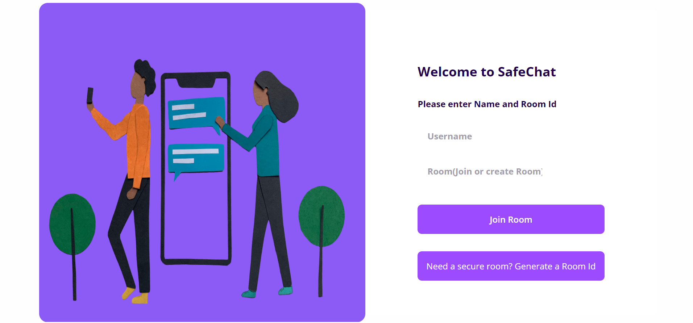

# SafeChat 💬
SafeChat is a open-source and secure chat app that prioritizes security in every aspect. It's easy to use and provides a platform for the secure exchange of confidential data.

## **What it does**
SafeChat provides a secure and user-friendly chat platform that protects user privacy and confidentiality. It is designed to keep user data secure at all times, and all communications are encrypted using the latest security protocols.

With SafeChat, users can easily exchange messages, share files, and communicate with each other in a safe and secure environment. The app's intuitive interface makes it easy to use, and its robust security features give users peace of mind knowing that their data is always protected.

## **How I built it**
I built SafeChat's frontend using HTML, CSS, and jQuery. The HTML provided the basic structure for the app, while CSS was used to style the app's interface. jQuery was used to create interactive elements and make the app more user-friendly.

For the backend, I used Express.js to create the server. Express.js is a popular web framework for Node.js that makes it easy to build web applications. It provides a range of features that simplify the process of building and managing web applications.

To handle data transmission, I used Socket.io. Socket.io is a library that makes it easy to establish real-time, bidirectional communication between the server and the client. It's ideal for building chat apps because it allows messages to be transmitted instantly, without the need for refreshing the page.

Overall, SafeChat was built using a combination of powerful frontend and backend technologies that work together to create a secure and user-friendly chat app.

## Challenges we ran into
Overall, building a messaging web app like SafeChat was a complex and challenging task, requiring careful planning, attention to detail, and a thorough understanding of web development and security principles.

## Accomplishments that we're proud of
Overall, building a messaging web app like SafeChat was challenging but rewarding experience, providing developers with the opportunity to create a platform that enables secure communication and enhances the user experience.

## What we learned
**Web development skills:** Building a web app like SafeChat requires a strong understanding of web development principles, including HTML, CSS, JavaScript, and server-side programming languages nodeJs, express and socket.io.

## What's next for SafeChat
- Fix bugs
- we also plan to integrate blockchain technology to enhance the security of SafeChat. This will provide an additional layer of security, making it even more difficult for attackers to compromise user data
- When a user leaves the chat, it only closes on one end, and other users can still see past messages. I would like to implement a “end-chat” function, that automatically runs as soon as a user leaves.
- Similar to what some other chat apps have, I would like to integrate a message expiry feature, where messages disappear after a fixed set of time if inactivity is detected, so all potentially important messages are not compromised
- Add a better chat system based on Markdown, that supports links, images, emoji (using Twemoji), and more. As of now, SafeChat only supports plain text.

## **Built With**

- css3
- express.js
- html5
- javascript
- jquery
- socket.io

## Try it out
- [SafeChat](https://safechat-dun.vercel.app/)
- [GitHub Repo](https://github.com/akashpanda122/SafeChat)
